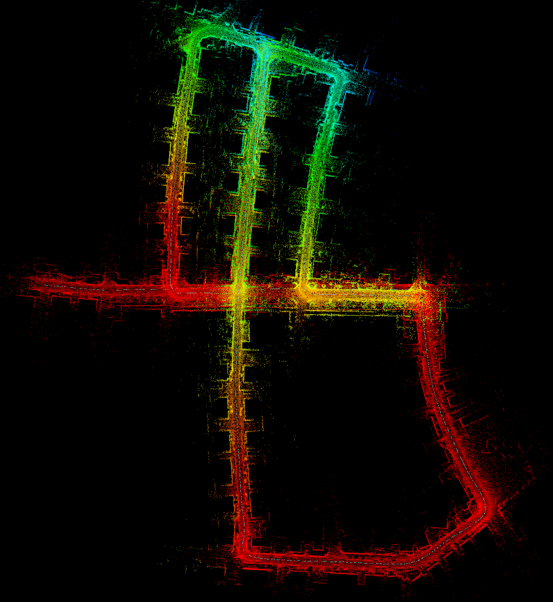
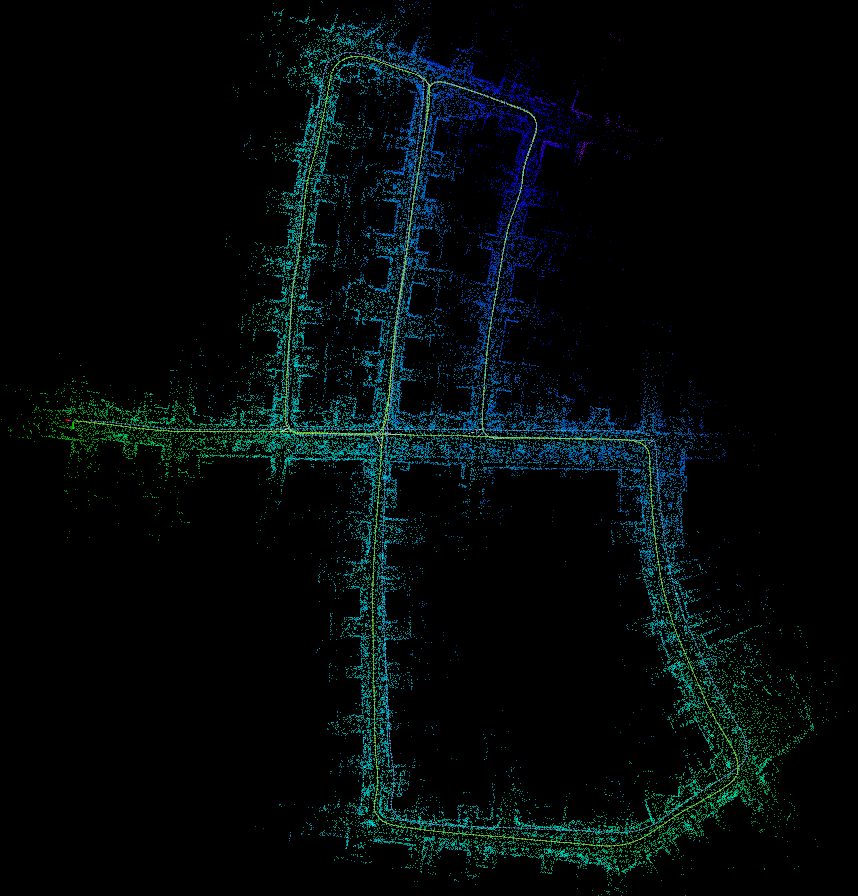
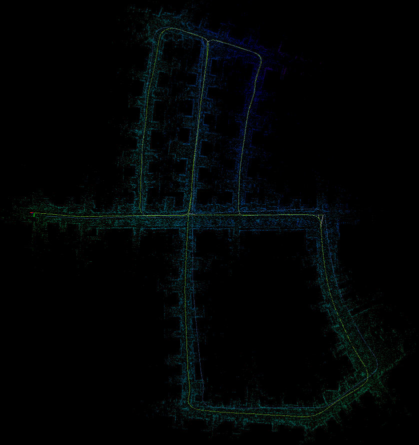
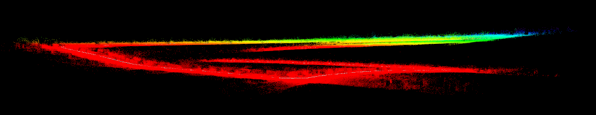
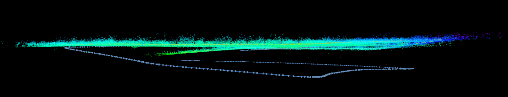
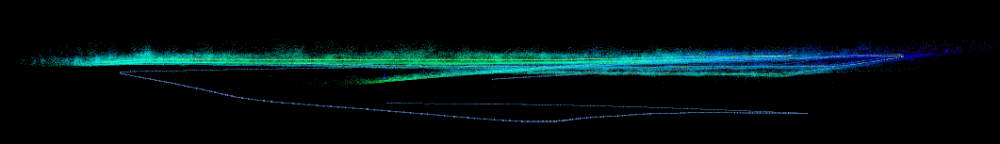

# FAST-LIO-SAM-QN
+ This repository is a SLAM implementation combining [FAST-LIO2](https://github.com/hku-mars/FAST_LIO) with pose graph optimization and loop closing based on [Quatro](https://quatro-plusplus.github.io/) and [Nano-GICP module](https://github.com/engcang/nano_gicp)
    + [Quatro](https://quatro-plusplus.github.io/) - fast, accurate and robust global registration which provides great initial guess of transform
    + [Quatro module](https://github.com/engcang/quatro) - `Quatro` as a module, can be easily used in other packages
    + [Nano-GICP module](https://github.com/engcang/nano_gicp) - fast ICP combining [FastGICP](https://github.com/SMRT-AIST/fast_gicp) + [NanoFLANN](https://github.com/jlblancoc/nanoflann)
+ Note: similar repositories already exist
    + [FAST_LIO_LC](https://github.com/yanliang-wang/FAST_LIO_LC): FAST-LIO2 + SC-A-LOAM based SLAM
    + [FAST_LIO_SLAM](https://github.com/gisbi-kim/FAST_LIO_SLAM): FAST-LIO2 + ScanContext based SLAM
    + [FAST_LIO_SAM](https://github.com/kahowang/FAST_LIO_SAM): FAST-LIO2 + LIO-SAM (not modularized)
    + [FAST_LIO_SAM](https://github.com/engcang/FAST-LIO-SAM): FAST-LIO2 + LIO-SAM (modularized)
+ Note2: main code (PGO) is modularized and hence can be combined with any other LIO / LO
    + This repo is to learn GTSAM myself!
    + and as GTSAM tutorial for beginners - [GTSAM 튜토리얼 한글 포스팅](https://engcang.github.io/2023/07/15/gtsam_tutorial.html)
## Video clip - https://youtu.be/MQ8XxRY472Y
<br>

## Computational complexity <br>in KITTI seq. 05 with i9-10900k CPU
+ FAST-LIO-SAM: max 118% CPU usage, 125 times of ICP, 124.9ms consumption on average
+ FAST-LIO-SAM-N (only Nano-GICP): max 164% CPU usage, 130 times of ICP, 61.9ms consumption on average
+ FAST-LIO-SAM-QN: 
    + Advanced matching - max 325% CPU usage, 85 times of ICP, 140ms consumption on average
    + Optimized matching (with max 200 correspondences downsampling) - max 569% CPU usage, 90 times of ICP, 128.6ms consumption on average
+ Note: `loop_timer_func` runs at fixed `basic/loop_update_hz`. So how many times of ICP occurred can be different depending on the speed of matching methods.

<p align="center">
  
  
  
  <br>
  <em>KITTI seq 05 top view - (left): FAST-LIO2 (middle): FAST-LIO-SAM (bottom): FAST-LIO-SAM-QN</em>
</p>
<p align="center">
  
  
  
  <br>
  <em>KITTI seq 05 side view - (top): FAST-LIO2 (middle): FAST-LIO-SAM (bottom): FAST-LIO-SAM-QN</em>
</p>

## Dependencies
+ `C++` >= 17, `OpenMP` >= 4.5, `CMake` >= 3.10.0, `Eigen` >= 3.2, `Boost` >= 1.54
+ `ROS`
+ [`GTSAM`](https://github.com/borglab/gtsam)
    ```shell
    wget -O gtsam.zip https://github.com/borglab/gtsam/archive/refs/tags/4.1.1.zip
    unzip gtsam.zip
    cd gtsam-4.1.1/
    mkdir build && cd build
    cmake -DGTSAM_BUILD_WITH_MARCH_NATIVE=OFF -DGTSAM_USE_SYSTEM_EIGEN=ON ..
    sudo make install -j16
    ```
+ [`Teaser++`](https://github.com/MIT-SPARK/TEASER-plusplus)
    ```shell
    git clone https://github.com/MIT-SPARK/TEASER-plusplus.git
    cd TEASER-plusplus && mkdir build && cd build
    cmake .. -DENABLE_DIAGNOSTIC_PRINT=OFF
    sudo make install -j16
    sudo ldconfig
    ```
+ `tbb` (is used for faster `Quatro`)
    ```shell
    sudo apt install libtbb-dev
    ```

## How to build and use
+ Get the code and then build the main code.
    ```shell
    cd ~/your_workspace/src
    git clone https://github.com/engcang/FAST-LIO-SAM-QN --recursive

    cd ~/your_workspace
    # nano_gicp, quatro first
    catkin build nano_gicp -DCMAKE_BUILD_TYPE=Release
    # Note the option!
    catkin build quatro -DCMAKE_BUILD_TYPE=Release -DQUATRO_TBB=ON
    catkin build -DCMAKE_BUILD_TYPE=Release
    . devel/setup.bash
    ```
+ Then run (change config files in third_party/`FAST_LIO`)
    ```shell
    roslaunch fast_lio_sam_qn run.launch lidar:=ouster
    roslaunch fast_lio_sam_qn run.launch lidar:=velodyne
    roslaunch fast_lio_sam_qn run.launch lidar:=livox
    ```

<br>

## Structure
+ odom_pcd_cb
    + pub realtime pose in corrected frame
    + keyframe detection -> if keyframe, add to pose graph + save to keyframe queue
    + pose graph optimization with iSAM2
+ loop_timer_func
    + process a saved keyframe
        + detect loop -> if loop, add to pose graph
+ vis_timer_func
    + visualize all **(Note: global map is only visualized once uncheck/check the mapped_pcd in rviz to save comp.)**

<br>

## Memo
+ `Quatro` module fixed for empty matches
+ `Quatro` module is updated with `optimizedMatching` which limits the number of correspondences and increased the speed
